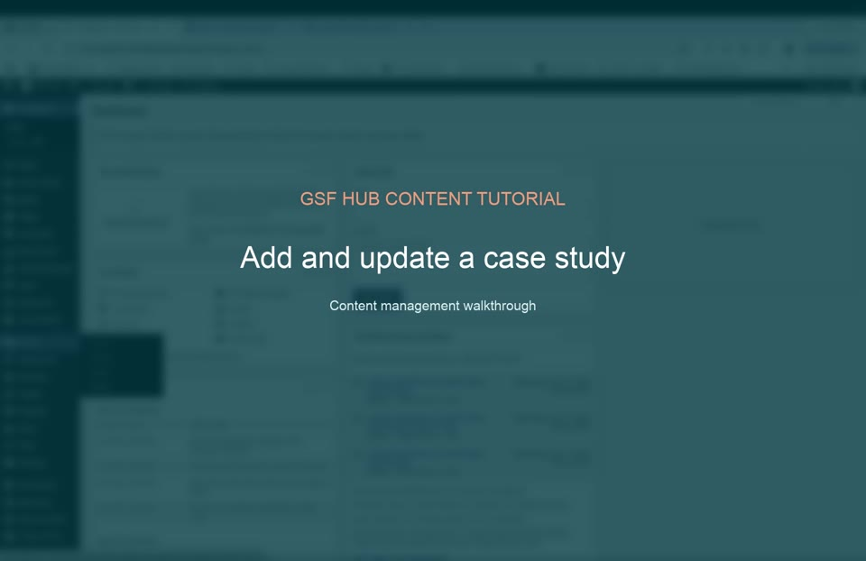

# Add and update a case study

**Duration:** 0:50  
**Video:** [Play or download the MP4](assets/case-study.mp4)

## What this tutorial demonstrates

- Opening the Case Studies area
- Creating or updating a case study
- Entering the title and summary
- Selecting the type, project, focus area, geography, and date
- Adding organizations, partners, files, links, and an image
- Publishing and testing the public case study

[Back to all tutorial videos](README.md)

