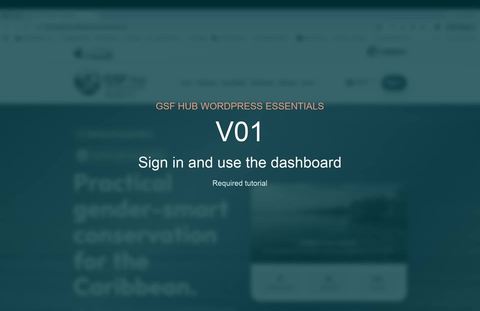

# V01 — Sign in and use the dashboard

**Duration:** 1:18  
**Priority:** Required  
**Video:** [Play or download the MP4](assets/v01-sign-in-dashboard.mp4)

## What this tutorial demonstrates

- Opening the GSF Hub sign-in page
- Entering account credentials safely
- Navigating the WordPress dashboard
- Adjusting dashboard Screen Options
- Reviewing profile settings
- Signing out safely on shared devices

[Back to all tutorial videos](README.md)

