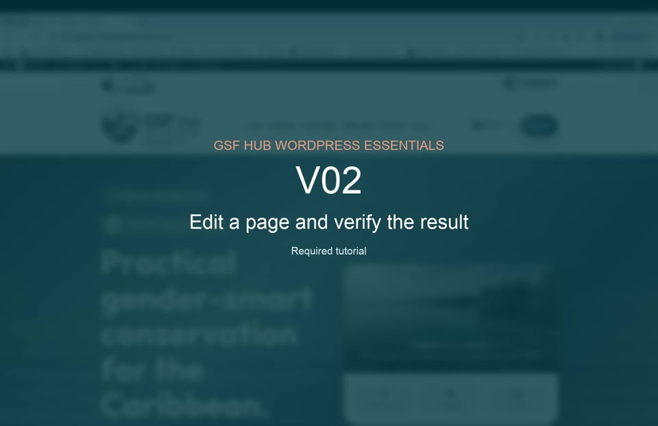

# V02 — Edit a page and verify the result

**Duration:** 1:18  
**Priority:** Required  
**Video:** [Play or download the MP4](assets/v02-edit-page.mp4)

## What this tutorial demonstrates

- Finding the correct page
- Editing content while preserving structure
- Previewing desktop and device views
- Publishing a new page or updating an existing page
- Checking links and mobile layout
- Restoring an earlier revision when needed

[Back to all tutorial videos](README.md)

