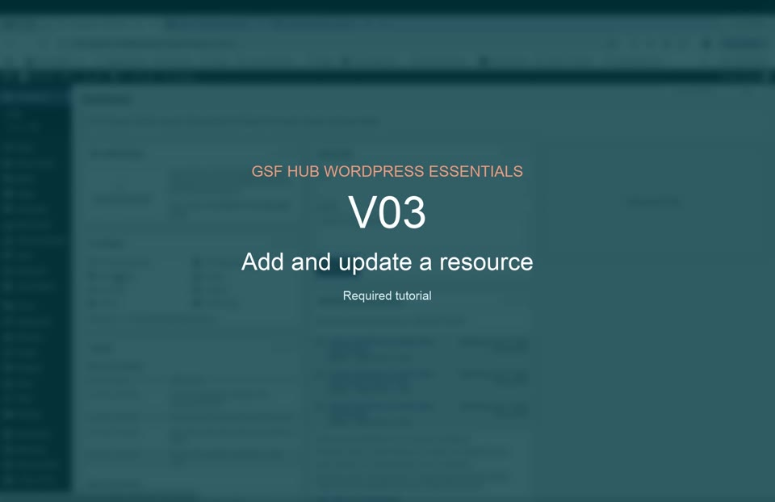

# V03 — Add and update a resource

**Duration:** 1:06  
**Priority:** Required  
**Video:** [Play or download the MP4](assets/v03-resource.mp4)

## What this tutorial demonstrates

- Opening the Resources area
- Creating or updating a resource
- Entering a title and summary
- Selecting type, topic, geography, language, and year
- Adding the source, file or URL, and featured image
- Publishing and testing the public resource

[Back to all tutorial videos](README.md)

