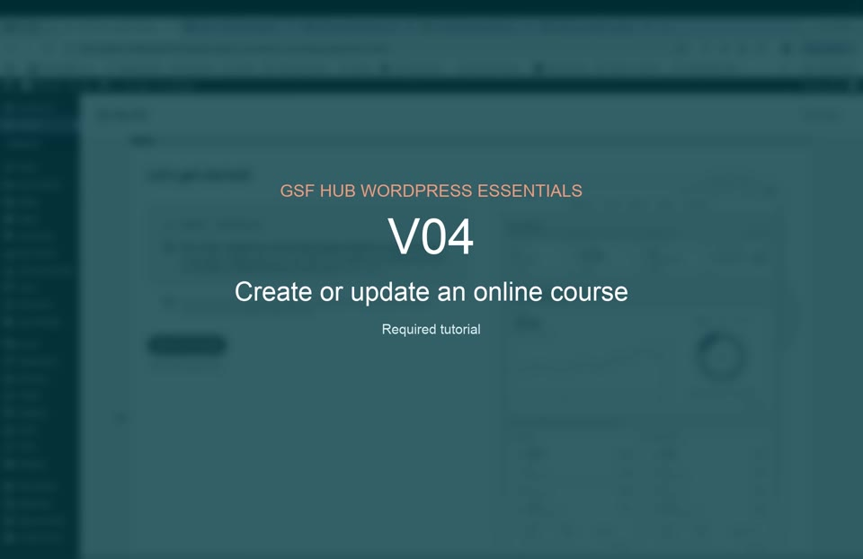

# V04 — Create or update an online course

**Duration:** 1:15  
**Priority:** Required  
**Video:** [Play or download the MP4](assets/v04-online-course.mp4)

## What this tutorial demonstrates

- Opening the Learn and SCORM areas
- Importing an approved course package
- Creating or updating the course entry
- Adding the description and featured image
- Selecting the package, duration, and learner-access settings
- Configuring catalogue order and certificate availability
- Testing course launch, completion tracking, and the certificate

[Back to all tutorial videos](README.md)

